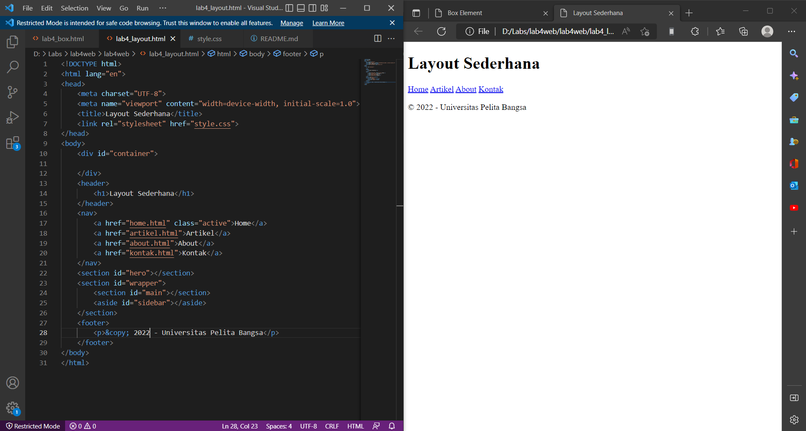
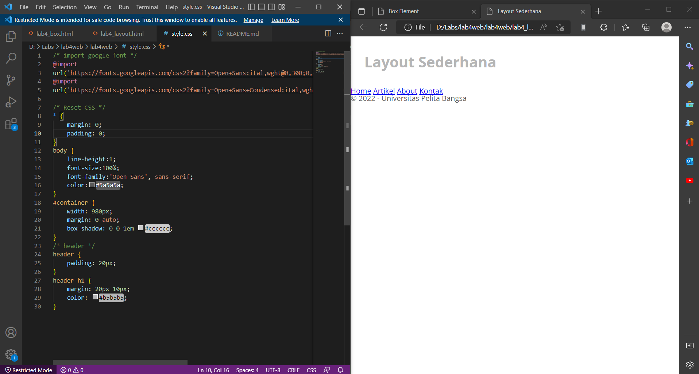
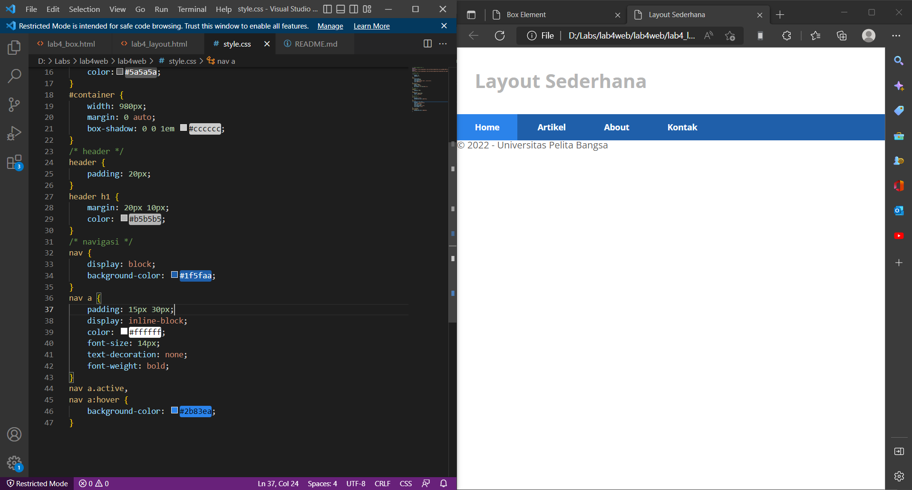
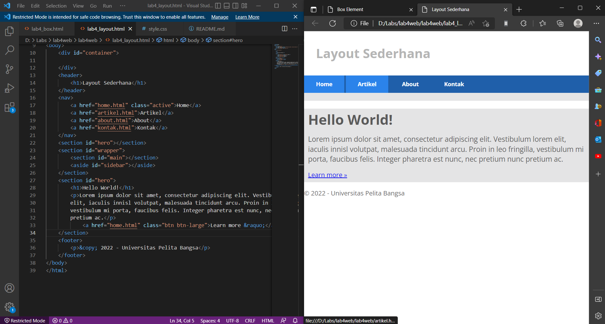
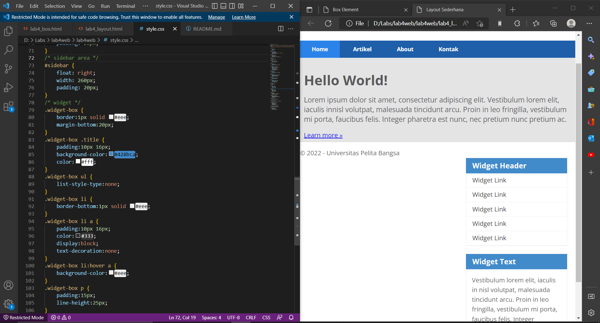
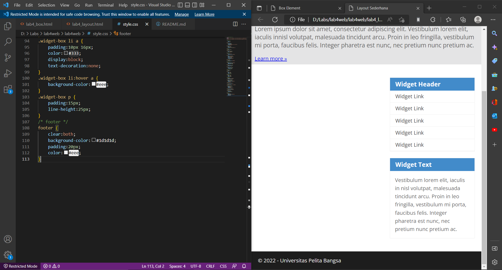
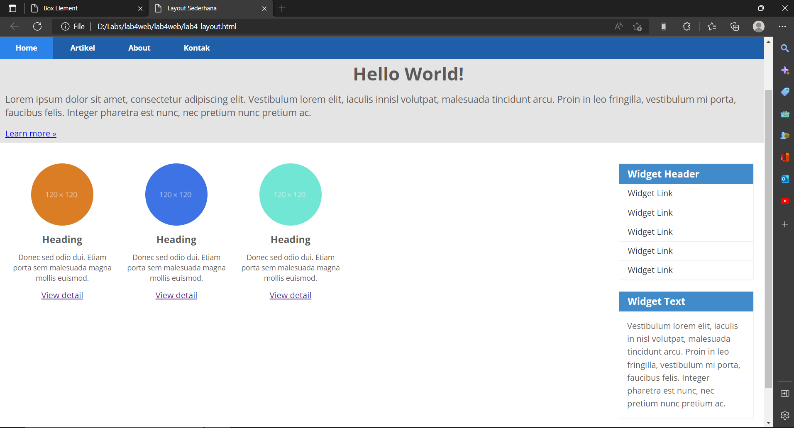
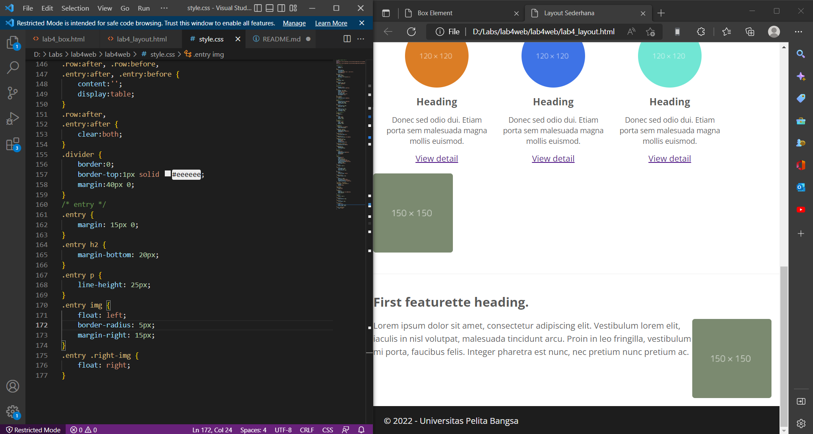

# lab4web
## persiapan membuat dokumen HTML dengan nama file lab4_box.html, Membuat Box Element dan CSS Float Property
ini adalah tampilannya 

## Mengatur Clearfix Element
ini adalah tampilannya

## Buat folder baru dengan nama lab4_layout, kemudian buatlah file baru didalamnya dengan nama home.html, dan file css dengan nama style.css.
ini adalah tampilannya 

## Menambahkan kode CSS untuk membuat layoutnya
ini adalah tampilannya

## Membuat Navigasi
ini adalah tampilannya

## Membuat Hero Panel
ini adalah tampilannya

## Mengatur Layout Main dan Sidebar
ini adalah tampilannya

## Mengatur Footer
ini adalah tampilannya

## Menambahkan Elemen lainnya pada Main Content
ini adalah tampilannya

## Menambahkan Content Artikel
ini adalah tampilannya
